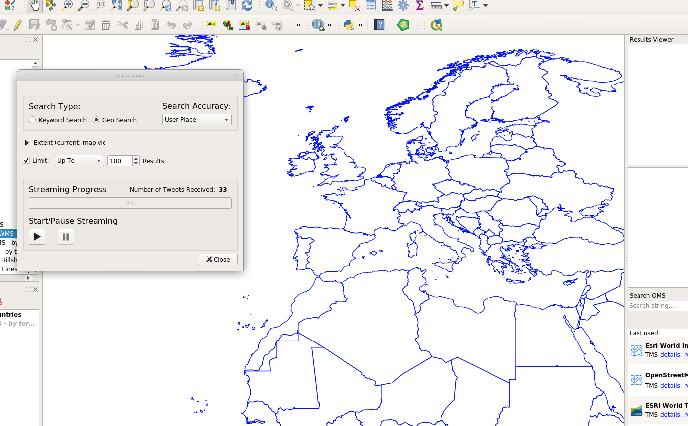
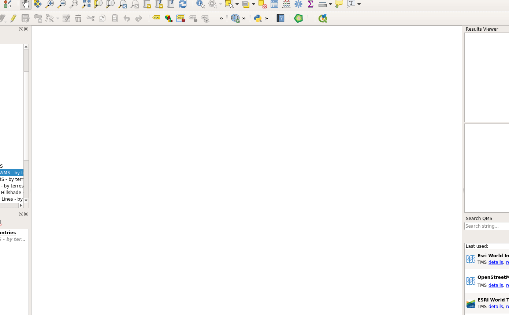

# Geotweet

**Introduction**

Geotweet is a QGIS 3 plugin that allows the connection to the Twitter API, stream Tweets (their text) and display them on the QGIS map canvas, if they contain geographic coordinates (EPSG:4326), in real time. Geotweet uses the Twitter streaming API, combining it with asynchronous code execution. This means that the tweets are received continuously in real time and are immediately displayed on the map without locking/freezing the QGIS user interface thread. 

Geotweet is desinged on the base of a QGIS 2 plug-in with the same name, project initiated by Riccardo Klinger -Geolicious-

**Getting Started Steps - Initial Configuration**

Geotweet uses the Python library [Tweepy](https://tweepy.readthedocs.io/en/3.7.0/getting_started.html). The package has to be installed as a third party package in the Python environment used by QGIS, and has to be installed separately before running Geotweet. To install third party Python packages please follow the instructions below:

For Windows (with OSGEO4W)
[Option 1](https://www.lutraconsulting.co.uk/blog/2016/03/02/installing-third-party-python-modules-in-qgis-windows/) 
[Option 2](https://gis.stackexchange.com/questions/246414/install-third-party-python-modules-in-qgis-windows) 

For Windows (standalone QGIS install)
[Option 3](https://gis.stackexchange.com/questions/273870/osgeo4w-shell-with-python3/277842#277842) -> this worked for me on Windows

For Linux (Debian):
QGIS Python is the system one, just do 

    pip3 install tweepy

Running a desktop Twitter app is not easy for authentication. The connection to the API requires the consumer keys which are unique to each Twitter application and have to be secretly stored, thus making it very difficult for a desktop application to developer ones. On top of it, using a Twitter app requires OAuth authentication which is granted by the user to the application with two tokens generated from Twitter. Though I tried to set up a seamless plug-in authentication for the reasons above you can use Geotweet only with your own Twitter API developer keys and generated OAuth tokens. To obtain the Twitter developer keys you will have to sign-up for a developer account and create a Twitter App. 

[Here is how to do it](https://developer.twitter.com/en/account/get-started)

Geotweets can work behind a proxy (provided that it grants access to Twitter), the functionality is offered by Tweepy. In order to set-up the proxy connection, in the root folder of the plugin you will find the `config.json` file in the `config/` folder. Under the `PROD` section insert your proxy URL, for example:

    "PROD": {
	    "CREDENTIALS": {
	    ...
	    },
    "PROXY": "http(s)://<your_proxy_server>:<your_proxy_port>"
    },
    /*in case your proxy requires authentication*/
    "<your_username>:<your_password>@<your_proxy_server>:<your_proxy_port>"

**What Geotweet can do**

From the Twitter Streaming API Geotweet:

 1. Downloads Tweets and displays them on the QGIS map canvas, retrieving tweet attributes such as `status_id, user_name, localization, extended_text, time, place`
 2. Filters Tweets Stream by keywords (more then one keyword are searched together in the tweet `extended_text` attribute field.
 3. Filters Twitter Tweets Stream by location. A search area (Bounding Box) can be defined either with the map canvas extent or using the extent of one layer between those loaded in the QGIS project.
 4. Limits the number of tweets to display/download, the limit can be absolute or continuous. In the first case the Stream listener will close the connection when the limit is reached. In the second case when the limit is reached the listener will continue to stream tweets, removing the tweets from the bottom of the list and adding the new ones as they continue, keeping the same number of tweets specified by the limit. 
 
 **EXAMPLES**
 
 
 
 
 
 
 
 
